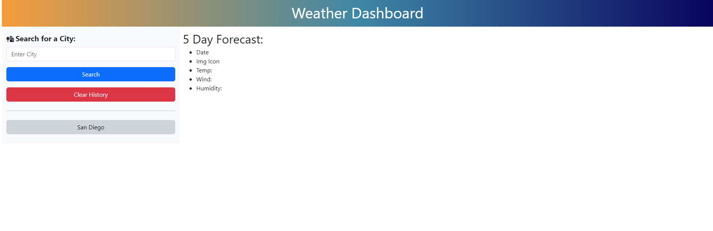

# Weather Dashboard

## Description
This weather dashboard application was created so that travelers or simply curious users could enter a desired city and find out the weather and 5 day forecast of that city.
The application uses HTML, CSS / Bootstrap, Javascript, and the OpenWeather API and functions with local storage that will save and display previously searched cities.
With this project I learned a lot about the OpenWeather API and how to set up a key and use it API parameters to get the desired information.

## Usage
 The user can enter a city name and it will search for and match the closest city with that name. It will provide current conditions in addition to a 5-day forecast. If it cannot find the city, it will alert the user. It will store the city in a list on the left side and as the user searches for more cities, they will be added to the list. The user is able to click cities that appear on the list to switch between them.
    

    
## Links
Deployed Page - https://dsoda86.github.io/weather-dashboard/

## License

MIT License

Copyright (c) [2023] [Douglas Soda]

Permission is hereby granted, free of charge, to any person obtaining a copy
of this software and associated documentation files (the "Software"), to deal
in the Software without restriction, including without limitation the rights
to use, copy, modify, merge, publish, distribute, sublicense, and/or sell
copies of the Software, and to permit persons to whom the Software is
furnished to do so, subject to the following conditions:

The above copyright notice and this permission notice shall be included in all
copies or substantial portions of the Software.

THE SOFTWARE IS PROVIDED "AS IS", WITHOUT WARRANTY OF ANY KIND, EXPRESS OR
IMPLIED, INCLUDING BUT NOT LIMITED TO THE WARRANTIES OF MERCHANTABILITY,
FITNESS FOR A PARTICULAR PURPOSE AND NONINFRINGEMENT. IN NO EVENT SHALL THE
AUTHORS OR COPYRIGHT HOLDERS BE LIABLE FOR ANY CLAIM, DAMAGES OR OTHER
LIABILITY, WHETHER IN AN ACTION OF CONTRACT, TORT OR OTHERWISE, ARISING FROM,
OUT OF OR IN CONNECTION WITH THE SOFTWARE OR THE USE OR OTHER DEALINGS IN THE
SOFTWARE.

---